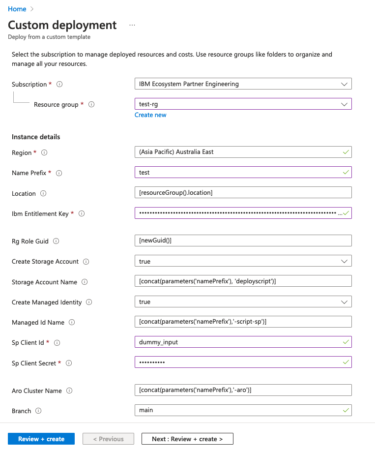

# Cloud Pak for Integration on ARO (BYOL)

Deploys Cloud Pak for Integration operators onto an existing Azure Red Hat OpenShift (ARO) cluster ready for the creation of instances.

It will deploy operators for the following CP4I components:
- Common Services
- Cloud Redis Database
- Platform Navigator
- Aspera
- App Connect
- Event Streams
- Asset Repository
- Data Power
- API Connect
- Operations Dashboard

## Instructions - Azure Portal

1. Press the `Deploy to Azure` button above.
2. Log into the Azure portal if not already
3. Fill in the parameters according to your requirements

- Choose the right subscription for the deployment
- Select the resource group that contains the ARO application (the one used to create the ARO cluster not the one containing the ARO cluster components)
- Select the region that contains the ARO cluster
- Provide a name prefix which will be used for deployed resources in Azure
- Leave location as is
- Enter your IBM API Entitlement Key
- Leave Rg Role as is, together with storage account creation and create managed identity (unless you have existing storage and managed identity associated with the resource group that can be utilized)
- Leave as is, or enter your own storage account name if using an existing one
- Leave the managed id name as is, or enter an existing one
- The sp client id and sp client secret fields are not used if deploying through the Azure portal. Add some dummy text to these fields.
- Enter the ARO cluster name that the CP4I operators should be deployed to
- Leave the branch as is

4. Click on `Review + Create`
5. Once validation is completed, click on `Create` to deploy the operators.