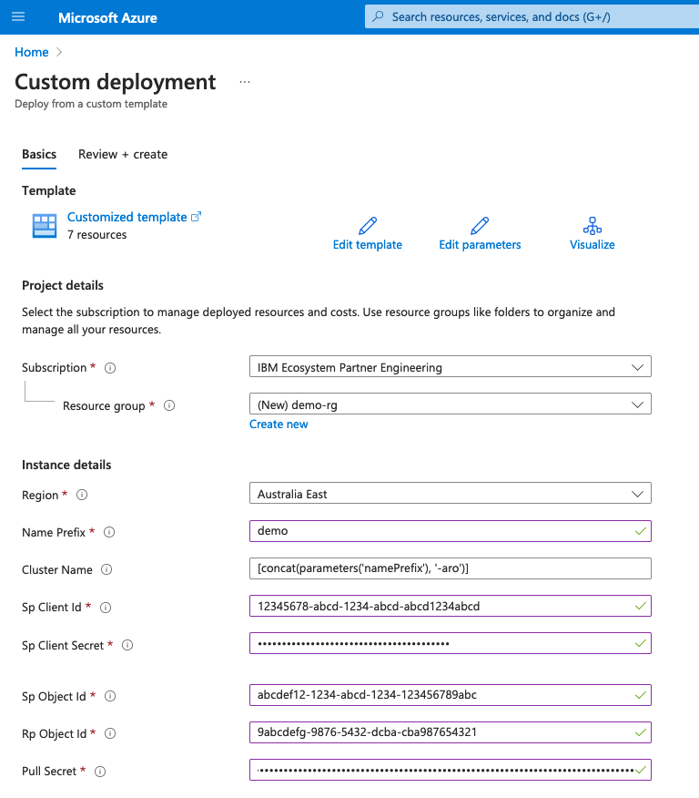
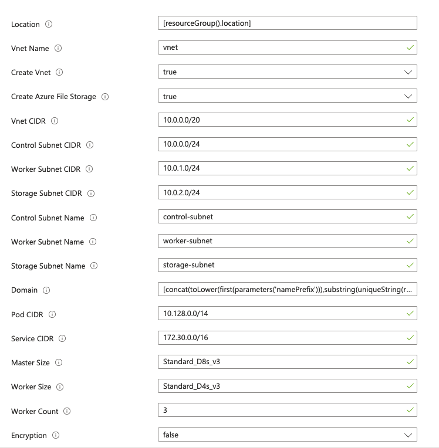
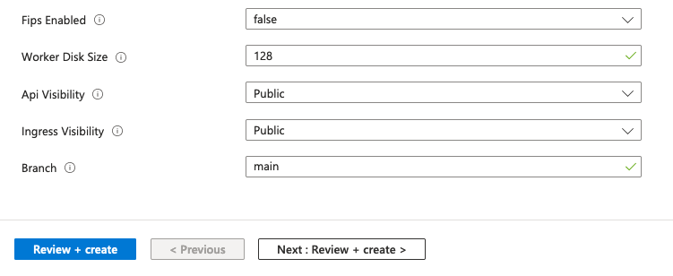

# Azure Red Hat OpenShift (ARO) cluster with Azure File Storage

[](https://portal.azure.com/#create/Microsoft.Template/uri/https%3A%2F%2Fraw.githubusercontent.com%2Fibm-ecosystem-lab%2Fazure-arm-templates%2Fmain%2Fopenshift%2Faro%2Fazuredeploy.json)
[](http://armviz.io/#/?load=https%3A%2F%2Fraw.githubusercontent.com%2Fibm-ecosystem-lab%2Fazure-arm-templates%2Fmain%2Fopenshift%2Faro%2Fazuredeploy.json)

This guide uses the Azure CLI tools. It is also possible to use the same template with the portal directly or PowerShell.

This template includes an option, on by default, that will create a file share storage account and setup Azure file storage in the Azure Red Hat OpenShift cluster.

The templates creates the following resources by default:
- A virtual network with control, worker and storage subnets
- A highly available Azure Red Hat OpenShift (ARO) cluster
- Azure private storage
- Configures Azure file storage on the ARO cluster for RWS filesystem storage

## Prerequisites

- Have an Azure subscription with user administrator access
- The subscription should have at least the following services resource providers registered:
    - Microsoft.Networks
    - Microsoft.Compute
    - Microsoft.Storage
    - Microsoft.RedHatOpenShift
    - Microsoft.Authorization
- Have the Azure CLI tools downloaded locally
- (Optional) Have `jq` installed if you want to use this to obtain some of the parameters per the below steps
- Have a Red Hat account if you are going to access the Red Hat marketplace post installation

## Execution steps - Azure Portal

1. Create a service principal in the Azure Active Directory
2. Click on the Deploy to Azure button above
3. Log into your Azure account if not already logged in
4. Fill in the parameters according to your requirements



- Choose the right subscription
- Create a new resource group or specify an existing one
- Specify the region into which to deploy resources
- Enter the name prefix. This will be used to prefix all created resources.
- Enter the cluster name which must begin with a character and be between 3 to 8 alphanumeric characters in length.
- Enter the client id for the service principal previously created
- Enter the password for the service principal preivously created
- Enter the object id for the service principal previously created
- Enter the Red Hat OpenShift resource provider id
    This can be obtained by running:
    ```
    az ad sp list --display-name "Azure Red Hat OpenShift RP" --query "[0].id" -o tsv
    ```
- Enter the Red Hat pull secret



- Location can be left as is
- VNet Name can be left unchanged if creating a new VNet. If using an existing VNet, specify the name of that VNet
- Create VNet true will create a new VNet with the above name in the resource group. 
- Setting Azure File Storage to true will create Azure private storage and configure file storage on the ARO cluster
- If creating a new VNet, leave the VNet and subnet CIDRs as are, otherwise enter the existing CIDR values for the VNet and subnets. Note that the deployment will only create subnets if creating a new VNet
- Likewise for the subnet names, leave as is for new VNet or enter existing subnet details if not creating a new VNet
- For the domain, either leave as is which will create a unique string based upon the resource group name, or enter your own which will prefix the azure domain for the console.
- Leave the POD and Service CIDR's as is unless it conflicts with the VNet CIDR
- Choose the size of the Master/control and Worker virtual machines. Note the allow sizes can be found [here](https://learn.microsoft.com/en-us/azure/openshift/support-policies-v4#supported-virtual-machine-sizes)
- Choose the number of required worker nodes. The minimum recommended is 3.
- Choose whether the disks should use encryption



- Leave FIPS enabled as false. This feature is not currently supported with this deployment.
- Enter the worker disk size. Minimum is 128GB.
- Leave the API Visibility as Public if using Azure file storage
- Leave the Ingress Visibility as Public if using Azure file storage
- Leave branch as main unless doing development work on other github branches of this repo.

- Press `Review + Create` to proceed. Once the Azure validation is completed, press `Create` to deploy the resources.

Once the resource deployment is complete, you can access the console by navigating in the Azure portal to the resource group you specified and selecting the ARO cluster. The details at the top include a console URL.

Login into the console with the credentials which can be found through the CLI as follows,
```
$ az aro list-credentials -n <cluster_name> -g <resource_group>
```
where
`<cluster_name>` is the name of the cluster entered earlier
`<resource_group>` is the new or existing resource group chosen earlier


## Execution steps - Azure CLI

1. Clone the repository and change to the ARO base directory if not already there.
    ```shell
    git clone https://github.com/ibm-ecosystem-lab/azure-arm-templates.git
    cd openshift/aro
    export BASE_PATH=$(pwd)
    ```

2. (Optional) Obtain a Red Hat OpenShift pull secret
    This allows the installation of operators from the Red Hat Marketplace. Refer [here](https://console.redhat.com/openshift/install/pull-secret) to obtain a pull secret. Save this pull secret to a file on your local machine.

    Note that the pull secret can also be added after the cluster has been created by following [these instructions](https://learn.microsoft.com/en-us/azure/openshift/howto-add-update-pull-secret)

3. Export the key parameters 
    This step allows the parameters to be defined once as you follow steps.
    ```shell
    export NAME_PREFIX="<name_prefix>"
    export RG_NAME="<resource_group_name>"
    export LOCATION="<resource_group_location>"
    export PULL_SECRET=$(cat <pull_secret_file_name>)
    ```
    where 
    - `<name_prefix>` is the identifier which will prefix created resources. Needs to start with a lower case letter and be between 3 and 10 characters in length. 
    - `<resource_group_name>` is the name to give to the resource group. This should always start with the a lower case letter.
    - `<resource_group_location>` is the Azure location to for the resource group.
    - `<pull_secret_file_name>` is the full path and filename to a file containing the Red Hat OpenShift pull secret you saved in step 2.


        To obtain a list of available locations for your subscription, run the following.
        ```shell
        az account list-locations -o table
        ```

4. Create a service principal for the cluster
    This is used by the cluster to provision resources (such as scaling the worker nodes).  Note that you can only have one cluster registered to a service principal, so it is recommended to create a new service principal for each cluster.
    1. Use the following commands to create a service principal.
        ```shell
        az ad sp create-for-rbac --name <name> | tee ./sp-details.json
        ```
        where `<name>` is the name to give the new service provider.

        **NOTE** Take note of the contents into a secure location and then delete the `sp-details.json` file once the below steps are completed as it contains the service provider security details.

    2. The following parameters for the build can be obtained from the output of this creation.
        ```shell
        export CLIENT_ID=$(cat ./sp-details.json | jq -r '.appId')
        export CLIENT_SECRET=$(cat ./sp-details.json | jq -r '.password')
        export CLIENT_OBJECT_ID=$(az ad sp show --id $CLIENT_ID --query "id" -o tsv)
        ```

5. Obtain the Azure Red Hat Openshift resource provider object id
    This is required to give the resource provider access to change the virtual network.
    To obtain the object id, run the following:
    ```shell
    export RP_OBJECT_ID=$(az ad sp list --display-name "Azure Red Hat OpenShift RP" --query "[0].id" -o tsv)
    ```

6. Create a resource group
    This resource group will be used for the deployment and will contain the virtual network together with the ARO resource. The ARO resource will create a separate resource group with the ARO components.
    ```shell
    az group create --name $RG_NAME --location $LOCATION
    ```

7. Create the deployment
    This will create the deployment in the resource group you just created.
    ```shell
    az deployment group create \
    --name aro_deployment \
    --resource-group $RG_NAME \
    --template-file ${BASE_PATH}/openshift/aro/azuredeploy.json \
    --parameters namePrefix=$NAME_PREFIX \
    --parameters spClientId=$CLIENT_ID \
    --parameters spClientSecret=$CLIENT_SECRET \
    --parameters spObjectId=$CLIENT_OBJECT_ID \
    --parameters rpObjectId=$RP_OBJECT_ID \
    --parameters pullSecret=$PULL_SECRET
    ```

## Clean up Steps

When you are finished with the environment. Perform the following steps to remove it. 

**Note** This will delete all data and settings. Only do this when the environment is no longer required.

1. Delete the base resource group
    ```shell
    az group delete --name <resource_group>
    ```
    where
    - `<resource_group>` is the resource group name shown in the table and originally specified during the build process.

2. Delete the service principal
    ```shell
    az ad sp delete --id <appId>
    ```
    where
    - `<appId>` is the service principal appId or client id that was created in the build process. If the file still exists, it is available in the `sp-details.json` file from the build process.

3. If not already, delete the `sp-details.json` file.
    ```shell
    rm ./sp-details.json
    ```

## Known limitations

If you are deploying Azure file share storage class through this approach, the API ingress must be public as the Azure deployment script utilized to create the storage class does not support private VNets.