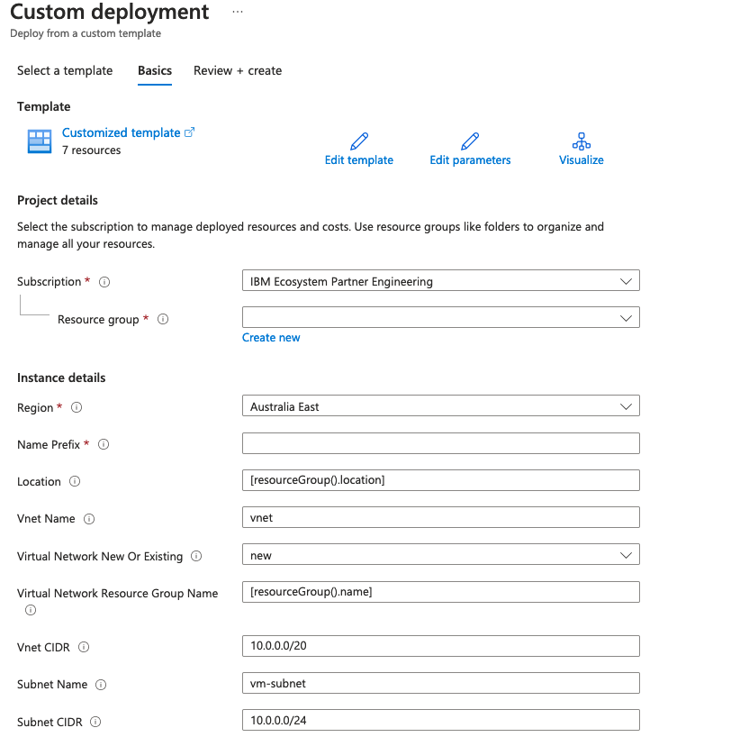
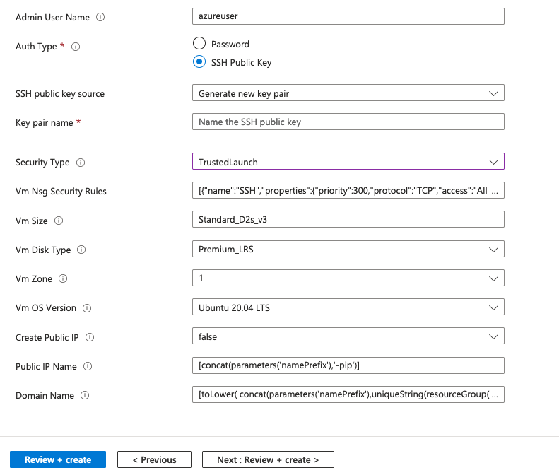

# Create an Azure cloud automation developer VM

[](https://portal.azure.com/#create/Microsoft.Template/uri/https%3A%2F%2Fraw.githubusercontent.com%2Fibm-ecosystem-lab%2Fazure-arm-templates%2Fmain%2Futilities%2Fdev-vm%2Fazuredeploy.json)
[](http://armviz.io/#/?load=https%3A%2F%2Fraw.githubusercontent.com%2Fibm-ecosystem-lab%2Fazure-arm-templates%2Fmain%2Futilities%2Fdev-vm%2Fazuredeploy.json)

## Prerequisites

The setup script is embedded in the `azuredeploy.json` ARM Template. Any changes to the script need to be base64 encoded and added to the ARM Template before use.

1. To encode the script, run the following from the same directory as this readme.

```
cat ./scripts/setup-dev-vm.sh| gzip -9 | base64 
```

2. Copy and paste the output to the `azuredeploy.json` script in the `Microsoft.Compute/virtualMachines/extensions` resource `.properties.protectedSettings.script`. 

## Passing parameters to the script.

Since the script is embedded into the ARM Template, there is no way of passing parameters to the script at run time. To pass parameters to the script, do the following.

1. Add the parameters to the variable `vmBootstrap`. 
    For example, add the following
    ```
    runcmd:\n - echo testdata=',parameters('testdata'),' >> /tmp/script-parameters.txt' \n
    ```

## Instructions

1. Press the `Deploy to Azure` button above
2. Fill in the parameters dialog for the custom deployment

    
    

    The key parameters to review and/or change are:
    - Choose the resource group or create a new one
    - Select the region to deploy to
    - Enter the name prefix for the resources
    - Select the auth type.
        - If it is to have a public IP, only SSH Public Key should be used.
        - You can generate a new key pair, use an existing one in Azure, or copy and paste one from your local machine.
    - Select whether to give it a public IP or not.

3. Once the parameters are ready, click on `Review + Create` to validate

4. Once validated, click `Create` to deploy the VM

5. Once deployment has completed (it should return with a `Your deployment is complete`), click on Outputs from the left side menu. This will give you the vm name, internal IP address, together with the external IP and FQDN if you chose to create a public ip.

6. If you chose to create a public IP, you can now reach your VM with the following.
    ```
    ssh -i <private_key_file> azureuser@<fqdn>
    ```
    where `<private_key_file>` is the path and filename of the private key on your local machine and `<fqdn>` is the fully qualified domain name provided in the outputs from the deployment.

## Debugging

The output of the script can be found here:
```
sudo cat /var/log/azure/custom-script/handler.log
```