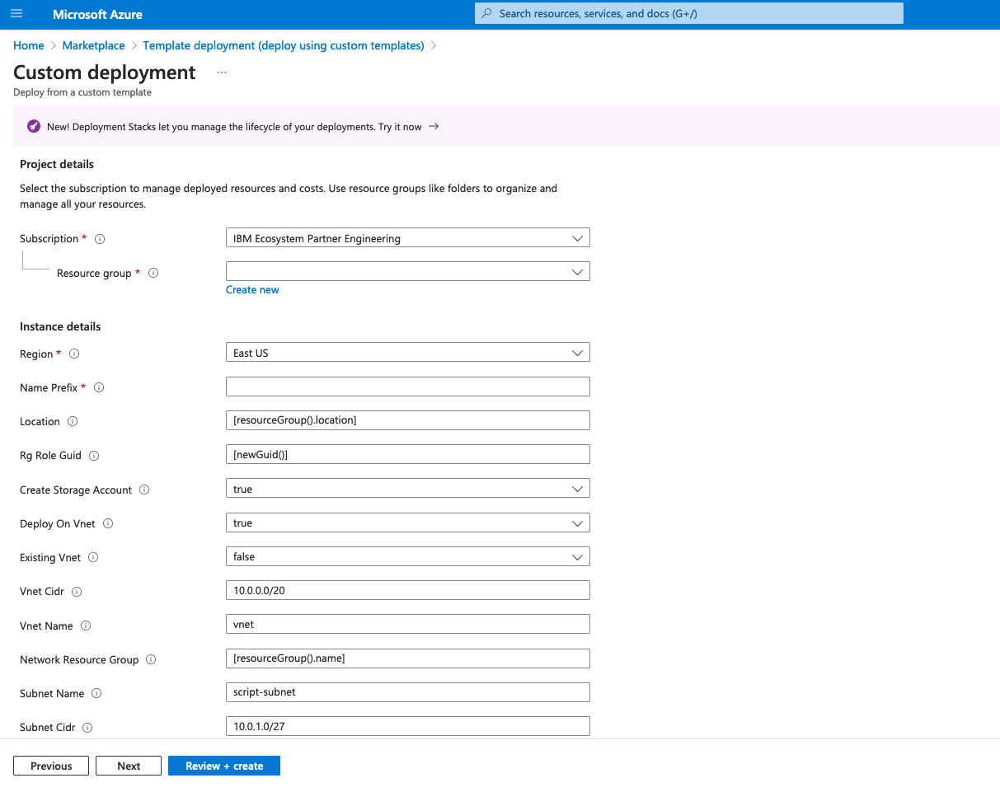

# Deploy a test container for Azure ARM Template deployment CLI scripts

This ARM Template run a container with an infinite loop.

Working scripts can then be uploaded to the container and the container can be connected to in order to run in terminal mode.

# Resources

Deploys the following resources:
- Storage account for container and shared files (if required)
- Managed Identity to run container
- Container group with Azure CLI container

# Deployment

To deploy this template, click on the `Deploy to Azure` button above. This will bring up a custom deployment screen in Azure once you login.

The key parameters to change are as follows.

1. If you have access to multiple subscriptions, ensure the right one is selected.

2. Select the existing resource group of the resources your script will be run against (or create a new resource group if you are creating new resources with the script)

3. Select the region to deploy the script into. This should be the same as the existing resource group to avoid performance impacts.

4. Specify a name prefix. This will be used to prefix the created resources.

5. If you are running this template for a second time in the same resource group, you should select false to creating a storage account and a managed identity as these should already be in place.

6. Click on `Review + Create` to deploy the template.

# Upload files
1. From the Azure portal, navigate to the resource group
2. Open the `<prefix>deployscript` storage account
3. Navigate to file shares
4. Open the share (will have a random name)
    - `azscriptinput` is the shared directory on the container that contains the running script
5. Upload your scripts as required

# Connect to container
1. From the Azure portal, navigate to the `<prefix>-cg` container group. 
2. Navigate to `Containers`
3. Click on connect and open terminal